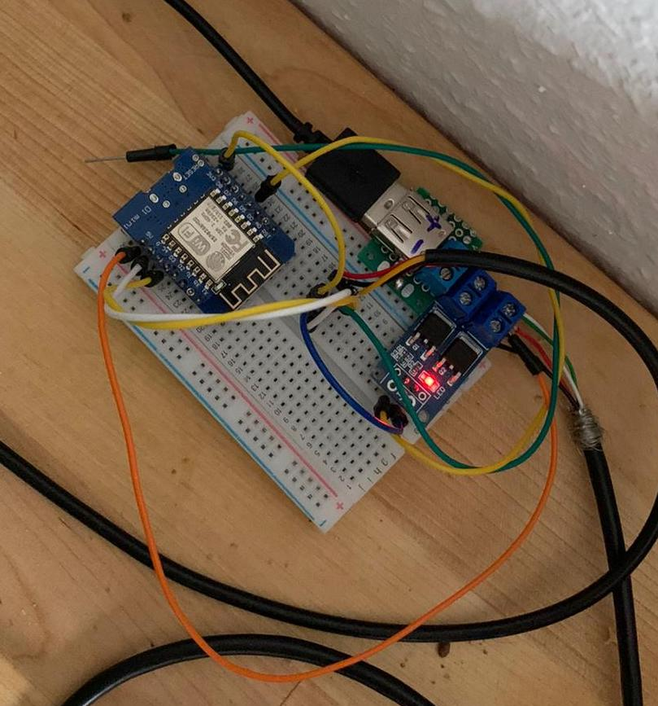
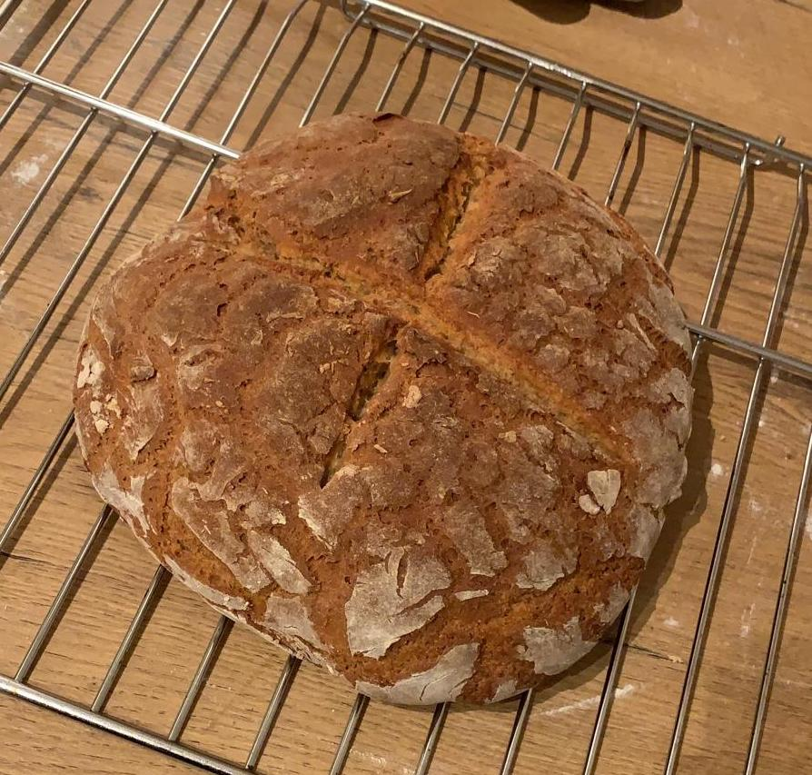

# Sauerteig

Ever wanted to make a good Sauerteig and struggled with keeping it at the right temperature?

No?

Okay, then feel free to stop here.

Why are you still reading this?

Okay so really had that problem? Me too. What do hobby engineers do if they see problems humanity
managed to solve over 100s of years without technology? Correct, they completely over-engineer it to
conceal their inability. Or they just want to have fun. There is just a fine line between genius and
insanity :D

*Man dude, get to the point, what is this thing doing?*

Okay okay, calm down. Essentially it just reads the current temperature and controls a heating
element.

*But hey, that's not over-engineered?*

Haha, not yet. Now add WiFi. And a Webinterface. And a PID control. And PWM. And persistent PID
parameters. The PID is the really interesting part. When turning the heating element just on and
off, we will always oscillate around the optimal temperature. and because heating is a slow process,
we will overshoot by a lot which might kill the Sauerteig.

So we make use of a MOSFET and PWM to gradually control the heating element. But how do we get to
the right duty cycle?

What we really want to know is how much energy we need to put into the Sauerteig to keep it at a
consistent temperature (assuming a constant environment temperature). This is exactly what the PID
control does. It learns to adjust the duty cycle over time to almost perfectly fit the environment.

Easily said, it does that by calculating the absolute error from our target and trying to keep the
error as small as possible. Same thing if you try to balance a pole on your hand. IF you want to
learn more, just google it. I'm not an expert :D

But in the end, it works very well and keeps the dough at the exact temperature.

*Engineer over and out.*

Using a mosfet switch from Amazon and a 5v heating element

End result:
